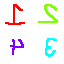

# rsi-flip
CLI tool for horizontally mirroring [RSI](https://docs.spacestation14.com/en/specifications/robust-station-image.html)s.
Each direction is horizontally mirrored and the east and west directions swap locations.

For example, this image would be flipped to become

this image

.

# Usage
It's really dead simple at the moment. You just run `rsi-flip -p <path to rsi file>`, and it'll create a new file in the
same directory with the `-flipped` suffix.

The tool assumes your image is square with even dimensions (because there're four quadrants). It should work with a wide
variety of formats, but I haven't tested it on anything that wasn't just a standard 64x64 256 RGBA PNG.

# Contact
I'll probably notice issues or whatever you create here, but feel free to beam me a message on Discord `@Centronias`.